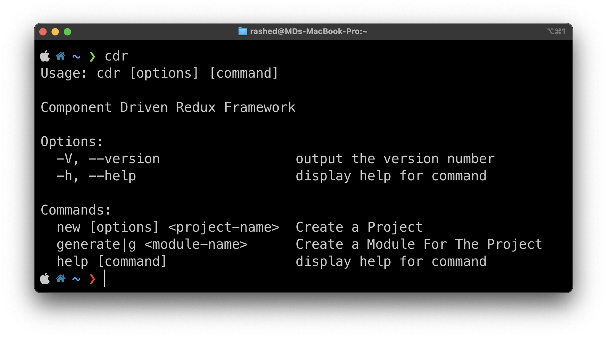

### Getting Started

### [Documentation](https://docs.fullstackbd.com/cdr/v1.0.0/getting-started.html)

Component Driven Redux is a Framework which combines the power of multiple powerful tools. they are `TypeScript`, `Vite`, `React`, `Redux`.
Our Framework focuses on making a React App fast but keeping sure that it is managable by implementing Redux Framework and TypeScript for better completeion and type safety and it uses Vite to bundle JavaScript Faster.

The Main Packages those were used is:

- `react`
- `redux`
- `@reduxjs/toolkit`
- `react-hook-form`
- `yup`
- `@hookform/resolvers`
- `react-router-dom`
- `vite`
- `typescript`

This is a prereleased version the main Version is in devlopment. currently there are lots of lacking like _`Testing`_, _`Automation`_ and etc. but the core components are complete
